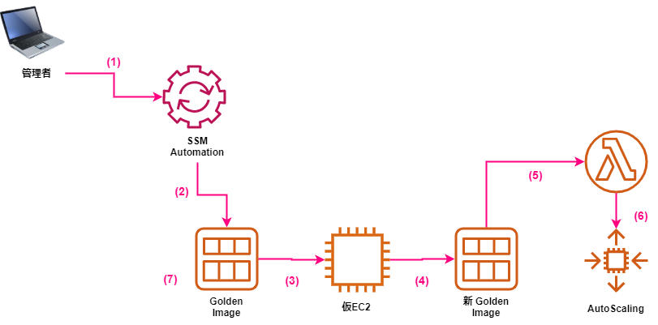

# aws-autoscaling-amiupdate

EC2 Auto Scaling 構成のゴールデンイメージ運用下で、ゴールデンイメージの更新と Auto Scaling グループのインスタンス更新を自動化しました。    
Systems Manager Automation と Lambda を組み合わせています。  


## 前提条件

* Auto Scaling グループ構成が正しく行われ、ALB & EC2 (アプリケーション) が正しく動作している
* 起動テンプレートを使用している
* ゴールデンイメージが常に最新状態を保っていること

## 構成



1. 管理者は Systems Manager Automation を実行する
2. (自動) Automation が開始する
3. (自動) 既存の Golden Image から仮の EC2 を起動し、アプリのデプロイを行う (RunCommand でコマンド実行する想定)
4. (自動) 仮 EC2 をシャットダウンし、新しい Golden Image を作成する
5. (自動) Lambda 関数を呼び出す
6. (自動) 起動テンプレートを修正する、新しい Golden Image から AutoScaling 配下で EC2 を起動する
7. (自動) 古くなった Golden Image を削除する


## 実装手順
AWS CLI をインストールし、クレデンシャルを構成しておきます。  
[AWS CLI バージョン 2 のインストール、更新、アンインストール](https://docs.aws.amazon.com/ja_jp/cli/latest/userguide/install-cliv2.html)  

ご自身のターミナルを開き implementation へ移動します。  

### AWS アカウントの指定
提供しているファイル内の account-id を契約している AWS アカウントに置換します。  
以下は置換コマンド例です。  

```
$ sed -i 's/<account-id>/123456789012/g' *
```

### デプロイコマンドの記述
autoscaling-amiupdate.yaml の65行目付近「# deployment command here」を実際のデプロイコマンドに置き換えます。  
例えば以下のようになります。行頭にハイフンを付けて一行ずつコマンドを記述します。  

```
          - aws s3 cp s3://example-bucketname/warfileName /tmp/warfileName
          - admin deploy --force /tmp/warfileName
          - if [ $? != 0 ]; then exit 255; fi
          - exit 0
```

### インスタンスプロファイルの作成
自動化のなかで仮 EC2 を起動します。  
その仮 EC2 で使用するインスタンスプロファイルを作成します。  
(すでに存在するインスタンスプロファイルを使用したい場合は本手順をスキップしても大丈夫です)  

以下のコマンドを実行します。  

```
bash 00-createinstanceprofile.sh
```

### SSM ドキュメントロール作成
SSM ドキュメント実行時に使用する IAM ロールを作成します。  

以下のコマンドを実行します。  

```
bash 01-createrole.sh
```

### Lambda 関数用ロール作成
Lambda 関数実行時に使用する IAM ロールを作成します。  

以下のコマンドを実行します。  

```
bash 02-createlambbarole.sh
```

### Lambda 関数作成
自動化プロセスの一部である Lambda 関数を作成します。  

以下のコマンドを実行します。  

```
bash 02-createlambdafunction.sh
```

### SSM ドキュメント作成
自動化プロセスを記述した SSM ドキュメントを作成します。  

以下のコマンドを実行します。  

```
bash 03-createdocument.sh
```


## 自動化実行方法
最新ゴールデンイメージの AMI ID をメモしておきます。  

[SSM ドキュメント](https://ap-northeast-1.console.aws.amazon.com/systems-manager/documents?region=ap-northeast-1) を開き、作成したドキュメントを検索・選択します。  
**オートメーションを実行する** をクリックします。  

入力パラメータを以下のように入力し、**実行** をクリックします。  

|設定項目|設定値|
|---|---|
|AutomationAssumeRole|CustomRoleSSMCreateImageASG を探す(実装手順通り実行した場合)|
|subnetId|任意のパブリックサブネットを指定|
|instanceprofileName|EC2SSMRole (実装手順通り実行した場合)|
|targetASG|対象の Auto Scaling グループ名を入力|
|launchtemplateId|対象の起動テンプレート ID を入力|
|sourceAMIid|メモした最新ゴールデンイメージの AMI ID を入力|
|securityGroupId|仮 EC2 用のセキュリティグループを指定|
|targetAMIname|GoldenImage-{{global:DATE_TIME}}|


### パラメータ入力を省略したい
パラメータはほぼ決め打ちになるはずです。  

都度入力が面倒な場合は autoscaling-amiupdate.yaml を編集します。  
4行目からパラメータを定義しています。  
ここに「default」を追加してドキュメントを更新します。  
22~25行目を参考にしてみてください。  

### パラメータ入力を省略したい その2
AWS CLI でパラメータを指定して実行する方法もあります。  
以下のように「--parameters」 の後ろに **設定項目=設定** をカンマでつなげていきます。  

```
$ aws ssm start-automation-execution --document-name "CreateGoldenImageandupdateASG" \
  --document-version '$LATEST' \
  --parameters "sourceAMIid=ami-xxxx,subnetId=subnet-xxxx"
```


## 自動化実行履歴
実行履歴を見たい、異常終了した際のログを見たい場合は AWS マネジメントコンソールから確認可能です。  

[Systems Manager Automation](https://ap-northeast-1.console.aws.amazon.com/systems-manager/automation/executions?region=ap-northeast-1)


## 関連リソース
実装手順通り実行すると以下のリソースが作成されます。  

|AWS Service|Resource Name|
|---|---|
|Systems Manager Automation|CreateGoldenImageandupdateASG|
|Lambda|Automation-UpdateAsg|
|IAM|EC2SSMRole|
|IAM|CustomRoleSSMCreateImageASG|
|IAM|Automation-UpdateAsg-role|

